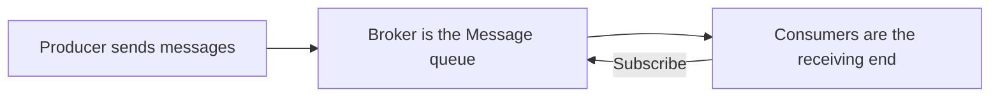

# Micro Services Communication

Since microservices are loosely coupled, hence brings about the need for effective communication between the different microservices and in real time to ensure effective working and synchronization. Since microservices involves a pattern running different machines or operations hence the need for effective communication and collaboration among the services to handle the requests. Hence choosing the right communication system is important

## Types of Microservices Communication

- Synchronous
  - Communicate through a REST endpoint over the HTTP protocol
  - The calling service has to wait until it is responded to
  - A chain of requests is created between the microservices when serving the client request
  
  ```mermaid
    graph TD;
        client---|Http sync request| cart;
        cart---|Http sync response| client;
        cart ---|Http sync request| ordering;
        ordering ---|Http sync response| cart;
        ordering ---|Http sync request| catalogue;
        catalogue ---|Http sync response| ordering;
        catalogue ---|Http sync request| notify;
        notify ---|Http sync response| catalogue;
        client ---|Same HTTP request/response cycle| notify;
  ```

- Asynchronous
  - Communicates through asynchronous messages or polling
  - The calling service will not wait for a response
  - Can be accomplished through message brokers like **Apache Kafka** and **RabbitMQ**

## Message Brokers : [RabbitMQ]

- One of the most popular open source message brokers
- Messages received by it are stored until received
- Lightweight easy to deploy and support multiple protocols
- Can be deployed in distributed and federated configurations
- Uses **AMQP** (Advanced Messaging Queuing Protocol) as the basisi for a set of standards controlling the process
- Implemented in Erlang/OTP

### Features of RabbitMQ

- Reliable deilvery
- Flexible routing
- sever clustering
- Federation Model
- High availability queues
- Multiprotocol support
- Supports multiple languages
- Tracing support in case of errors
- Management Ui for easy monitoring
- Plugin System for imporving functionality

## How RabbitMQ works

It accepts and forwards messages like a mail service, receiving messges from one party and holding them until they are received by the other party

- **Producing:** This means sending. A _producer_ is a program that sends a message
- **Queue:** A name for a post box in side the RabbitMQ. The messages flow through RabbitMQ and other apps via the queues. It is also where they are stored
- **Consuming:** This is simply put, receiving and a _consumer_ is a program that mostly waits to receive messages
- The producer and consumer doesn't necessary have to be the same host. a single application can be both producer and a consumer at the main time

## Architecture of a RabbitMQ Message Queue



The producer service is the producer of messages
messges are not sent directly to the queue
they are sent to an _exchange_ which then routes the messages to the appropriate queues through headers, bindings, attributes etc If no exchange was specified, the default exchange is used
Then the conusmers received these messages from the exchange
